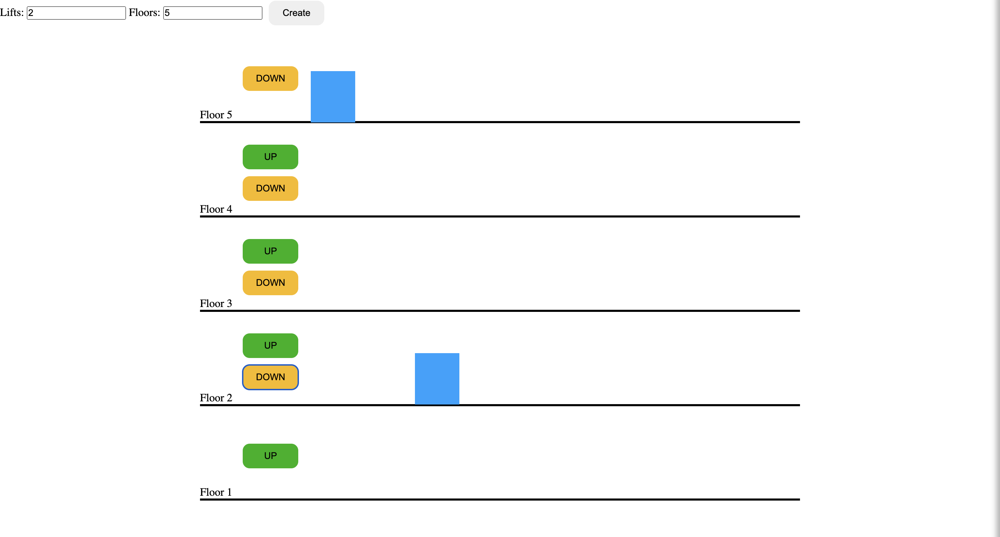

# Lift Simulation
Real Dev Squad Project

## UI

## Implementation Details
- ESmodules for implementing a modular design approach in javascript 
- Have implemented an MVC architecture
- Data structure used Priority Queue with Hashing
- CSS transformations for creating animation